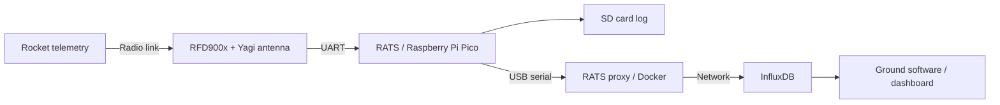

# RATS Software

**Ground telemetry firmware for the Cornell Rocketry Team.** The Rotational Antenna Tracking System (RATS) receives rocket telemetry through an RFD900x radio, decodes packets on a Raspberry Pi Pico, records them to an SD card, and forwards them over USB to the ground software.

RATS connects the rocket's flight software to the team's ground monitoring system. This repository contains the embedded C++ firmware on `main` and the Docker-based host proxy on [`radio-proxy`](https://github.com/cornellrocketryteam/RATS-Software/tree/radio-proxy).

## System overview



The current `main` firmware implements the telemetry receiver, logger, and USB bridge. The broader RATS design includes pointing a directional antenna toward the rocket using GPS and altitude data; motor control is not implemented in this branch, and local GNSS initialization is disabled in the main program.

### Telemetry pipeline

1. **Receive radio data.** Read the RFD900x over UART at 115200 baud, with 8 data bits, no parity, and 1 stop bit.
2. **Decode packet bursts.** Search incoming bytes for the `0x3E5D5967` synchronization word and extract complete, packed [`Telemetry`](src/telemetry.hpp) records. One radio burst can contain multiple packets.
3. **Persist locally.** Append decoded telemetry to an SD card log, including timestamps, GPS position, altitude, inertial measurements, and vehicle status fields.
4. **Forward to the host.** Send each decoded record as binary data over USB CDC. The [host proxy](https://github.com/cornellrocketryteam/RATS-Software/tree/radio-proxy/test/proxy) parses the serial data and writes it to InfluxDB for use by the ground software.

The firmware's USB output is a packed binary record, not JSON. The flight software, Pico firmware, and host proxy must agree on field order, field sizes, and byte order.

## Explore the code

| Component | Source | Role |
| --- | --- | --- |
| Firmware entry point | [`src/main.cpp`](src/main.cpp) | Initializes peripherals and runs reception, logging, and USB forwarding. |
| Radio decoder | [`src/radio.cpp`](src/radio.cpp) | Configures UART and extracts telemetry from incoming bursts. |
| Packet definition | [`src/telemetry.hpp`](src/telemetry.hpp) | Defines the packed telemetry layout shared with the transmitter and proxy. |
| SD logging | [`src/sd.cpp`](src/sd.cpp) | Writes readable telemetry records using FatFS. |
| Hardware configuration | [`src/pins.hpp`](src/pins.hpp), [`src/hw_config.c`](src/hw_config.c) | Defines radio and SD card interfaces. |
| Peripheral experiments | [`test/`](test/) | Contains radio, GPS, SD card, bus-scan, and payload communication programs. |
| Host proxy | [`radio-proxy` branch](https://github.com/cornellrocketryteam/RATS-Software/tree/radio-proxy) | Provides the Docker-based serial-to-InfluxDB application. |
| GNSS library | [`ublox-MX-Pico`](https://github.com/cornellrocketryteam/ublox-MX-Pico) | Separate Pico library for configuring and reading the MAX-M10S; included as a submodule. |

## Hardware

The receiver uses a Raspberry Pi Pico on the RATS board, an RFD900x radio with a Yagi antenna, an SD card reader, and a USB connection to the host computer.

The default firmware uses these **Pico GPIO numbers**, not physical header pin numbers:

| Interface | Configuration |
| --- | --- |
| Radio UART | `uart1`: TX on GP4, RX on GP5; 115200 baud, 8N1, no hardware flow control. |
| SD card SPI | `spi0`: MISO on GP16, CS on GP17, SCK on GP18, MOSI on GP19. |
| Host connection | Pico USB CDC serial. |

Connect the Pico TX signal to the radio RX signal and the Pico RX signal to the radio TX signal. Consult the board documentation for power connections and the complete wiring configuration.

## Build and flash the Pico firmware

### Prerequisites

- CMake 3.22 or newer.
- An Arm bare-metal GCC toolchain with `arm-none-eabi-gcc` available on `PATH`.
- Python 3 and a build tool supported by CMake, such as Make or Ninja.
- Git and the repository's submodules: the Pico SDK, FatFS SD card library, and u-blox GNSS library.

### Build

```sh
git clone https://github.com/cornellrocketryteam/RATS-Software.git
cd RATS-Software
git submodule update --init --recursive
cmake -S . -B build
cmake --build build --parallel
```

The Pico SDK submodule uses a GitHub SSH URL, so the submodule command requires working GitHub SSH access. To fetch the submodules over HTTPS instead, use this command in place of the submodule command above:

```sh
git -c 'url.https://github.com/.insteadOf=git@github.com:' submodule update --init --recursive
```

The CMake project uses C++17 and produces **`build/rats.uf2`**. Hold the Pico's **BOOTSEL** button while connecting USB, then copy that file onto the mounted Pico drive. The board restarts with the firmware.

The receiver needs a mounted SD card to complete startup. Use the [`radio-proxy` branch instructions](https://github.com/cornellrocketryteam/RATS-Software/tree/radio-proxy#how-to-use) for the host-side Docker application.

## Development notes

- **Radio bursts:** the decoder handles multiple complete packets in a burst. Retaining a packet split across separate bursts is still a TODO in `src/radio.cpp`.
- **USB diagnostics:** `RATS_VERBOSE` and `RATS_TIME` are enabled in `CMakeLists.txt`. They print text to the same USB serial interface used for binary telemetry; disable those definitions when feeding a consumer that expects only binary records.
- **SD logs:** the current logger appends to `log-4-13.txt`; it does not create a new filename for each run.
- **Tracking work:** `src/stepper.hpp`, `src/mover.hpp`, and `src/formulas.hpp` contain interfaces for future antenna movement and coordinate calculations. They are not a working tracking controller.
- **Hardware tests:** programs under `test/` are standalone development tools, not an automated test suite. Review each program's wiring and build configuration before using it.

## Team documentation

[RATS Software on Confluence](https://confluence.cornell.edu/display/crt/RATS+Software) contains the internal design notes, radio configuration, and troubleshooting guidance. **Access is restricted to Cornell Rocketry Team students.**

## License

See [LICENSE](LICENSE) for the GNU General Public License, version 3.
